# 💫 Zeyad Mohammed

<div align="center">
  
[](https://github.com/zeyad-mohammed-dev)

</div>

<div align="center">
  
</div>

<div align="center">
  
### 🚀 Backend Developer from Egypt | ⚡ Building scalable and efficient server-side applications

</div>

---

###  About Me:


```typescript
const zeyad = {
  name: 'Zeyad Mohammed',
  location: 'Sohag, Egypt 🇪🇬',
  role: 'Aspiring Backend Developer',
  education: 'CS Student (Higher Technological Institute)',
  passion: ['Backend Development', 'API Design', 'Database Management'],
  currentFocus: 'Building RESTful APIs with Node.js & Express',
  askMeAbout: ['Node.js', 'Express', 'MongoDB', 'MySQL', 'REST APIs'],
  motto: 'Perfection is the enemy of progress. Start small, learn consistently, and ship things.',
};
```

- 🔭 I'm currently building backend projects and improving my API design skills.
- 🌱 I'm learning best practices for databases (SQL & NoSQL) and using TypeScript on the backend.
- 👯 I'm looking to collaborate on **Open Source backend projects**.
- 💬 Ask me about **Node.js, Express, REST APIs, database modeling**.
- 📫 How to reach me: **zeyadmohammed200493@gmail.com**
- ⚡ Motto: **Progress isn’t about speed — it’s about direction. 🚀**

---

## 🛠️ Tech Stack

### 🎯 **Current Backend Arsenal**

<div align="center">


</div>

---

### 🎯 **Next Learning Goals**

<div align="center">


</div>

---

## 📊 GitHub Analytics

<div align="center">
  
  
  
  
  <details>
    <summary>More stats</summary>
    
  </details>
</div>

---

## 🏆 Featured Projects

<div align="center">

<table>
  <tr>
    <td width="50%" valign="top">

### 🌟 [SarahaApp](https://github.com/zeyad-mohammed-dev/SarahaApp)


**Anonymous feedback app (Saraha)**

- 🚀 Built with JavaScript / Node.js
- 🗄️ Stores and displays anonymous messages with a simple UI
- 🔒 Ready to extend with auth & moderation

    </td>
    <td width="50%" valign="top">

### 👤 [Profile Repo](https://github.com/zeyad-mohammed-dev/zeyad-mohammed-dev)


**Personal profile & portfolio**

- 📝 README shows tech stack, featured projects and analytics
- 🎯 Focused on backend projects, learning goals and progress

      </td>

    </tr>
  </table>

</div>

<div align="center">
  
[](https://github.com/zeyad-mohammed-dev?tab=repositories)

</div>

---

## 🌐 Connect With Me

<div align="center">

[](https://linkedin.com/in/zeyad-mohammed-dev)
[](mailto:zeyadmohammed200493@gmail.com)
[](https://github.com/zeyad-mohammed-dev)

</div>

---

## 📈 Contribution Graph

<div align="center">
  


</div>

<div align="center">
  <picture>
    <source
      media="(prefers-color-scheme: dark)"
      srcset="https://raw.githubusercontent.com/platane/snk/output/github-contribution-grid-snake-dark.svg"
    />
    <source
      media="(prefers-color-scheme: light)"
      srcset="https://raw.githubusercontent.com/platane/snk/output/github-contribution-grid-snake.svg"
    />
    
  </picture>
</div>

---

## 🏆 GitHub Trophies

<div align="center">
  


</div>

---

## 💼 Experience & Skills

```mermaid
timeline
    title 🧭 My Development Journey
    2023    : 💻 Started Programming Journey
            : 🧩 Practiced Problem Solving using C++
            : 🧠 Built strong logic & algorithmic thinking
            : 🐍 Learned Object-Oriented Programming (OOP) with Python
    2024    : 🌐 Explored Frontend Basics (HTML & CSS)
            : 💡 Discovered passion for Backend Development
    2025    : 🚀 Focused on Backend with Node.js & Express
            : 🗄️ Learned Databases (MySQL & MongoDB)
            : 🧱 Built RESTful APIs & real-world backend projects
            : 🔷 Exploring TypeScript & advanced backend patterns

```



---

📫 Let's Build Something Meaningful Together!

<div align="center">
💡 "Great things take time — just keep building and improving."


💼 Currently focusing on backend development | 🤝 Open to collaboration & learning | 🚀 Always building, one project at a time


</div>
